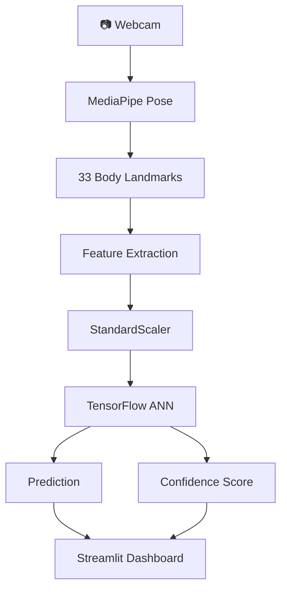
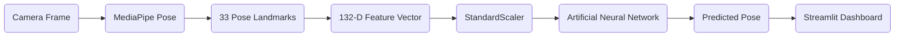
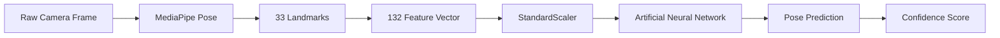
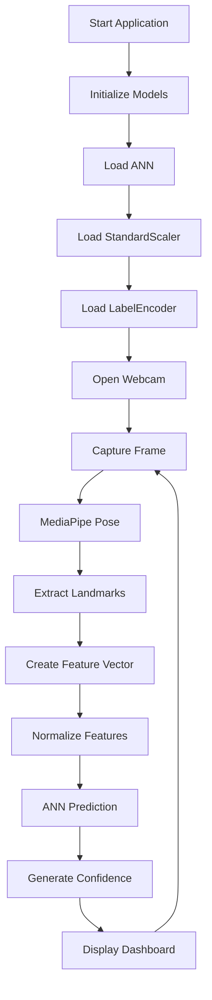

<!-- ============================================================= -->
<!--                    AI-Based Exercise & Yoga Pose Detection System -->
<!-- ============================================================= -->

<p align="center">
  
</p>

<h1 align="center">
🧘  AI Exercise Assistant🏋️
</h1>

<h3 align="center">
Real-Time Human Pose Estimation & Intelligent Exercise Classification using <br>
MediaPipe Pose • TensorFlow (ANN) • OpenCV • Streamlit
</h3>

<p align="center">


</p>

---

<p align="center">

<a href="#-project-overview">Overview</a> •
<a href="#-key-features">Features</a> •
<a href="#-system-demo">Demo</a> •
<a href="#-screenshots">Screenshots</a> •
<a href="#-project-architecture">Architecture</a> •
<a href="#-technology-stack">Tech Stack</a> •
<a href="#-installation">Installation</a> •
<a href="#-author">Author</a>

</p>

---

# 🌟 Project Overview

The **AI-Based Exercise & Yoga Pose Detection System** is a production-ready, real-time Computer Vision application designed to recognize and classify human exercise and yoga poses using Artificial Intelligence.

The system combines **MediaPipe Pose**, **TensorFlow Artificial Neural Networks (ANN)**, **OpenCV**, and **Streamlit** to create a complete end-to-end intelligent pose recognition pipeline.

Instead of relying on traditional image classification alone, the application first detects the human body's skeletal structure using **33 body landmarks**, converts those landmarks into structured numerical features, preprocesses the data using **StandardScaler**, and finally predicts the pose using a trained **Artificial Neural Network**.

The entire inference pipeline runs in real time, allowing users to receive instant predictions while performing exercises or yoga poses in front of a webcam.

This project demonstrates the practical integration of:

- Human Pose Estimation
- Deep Learning
- Feature Engineering
- Real-Time Computer Vision
- Machine Learning Deployment
- Interactive Dashboard Development

making it an excellent example of a modern AI-powered fitness application.

---

# 🎯 Why This Project?

Maintaining proper posture while exercising or practicing yoga is essential for maximizing performance and preventing injuries.

Most beginners perform exercises incorrectly due to the lack of professional guidance.

This project aims to solve that problem by providing a real-time AI assistant capable of recognizing body posture instantly and classifying the performed exercise or yoga pose using computer vision and deep learning.

The project can serve as the foundation for future intelligent fitness applications such as:

- AI Fitness Coach
- Smart Gym Assistant
- Yoga Trainer
- Physical Rehabilitation Assistant
- Home Workout Monitoring
- Sports Performance Analysis

---

# 🚀 Key Features

| Feature | Description |
|----------|-------------|
| 🎥 Real-Time Webcam Detection | Captures live webcam feed and processes every frame instantly. |
| 🦴 Human Pose Estimation | Detects 33 body landmarks using Google's MediaPipe Pose. |
| 🧠 AI Pose Classification | Uses a trained Artificial Neural Network (TensorFlow/Keras) for intelligent pose prediction. |
| 📊 Live Confidence Score | Displays prediction confidence in real time. |
| ⚡ High-Speed Inference | Optimized pipeline for smooth real-time performance. |
| 📈 FPS Monitoring | Displays live Frames Per Second for performance tracking. |
| 🎯 Feature Scaling | Uses StandardScaler to normalize landmark coordinates before prediction. |
| 🖥️ Interactive Dashboard | Modern Streamlit interface with live analytics. |
| 🧩 Modular Codebase | Clean separation of UI, inference engine, configuration, and model loading. |
| 🔄 End-to-End AI Pipeline | Complete pipeline from webcam input to live prediction output. |

---

# 🎥 System Demo

> **Demo GIF Placeholder**

<p align="center">


</p>

---

# 📷 Screenshots

## Dashboard

<p align="center">


</p>

---

## Live Pose Detection

<p align="center">


</p>

---

## MediaPipe Landmark Detection

<p align="center">


</p>

---

## AI Prediction Dashboard

<p align="center">


</p>

---

# 🏗 Project Architecture

The application follows a modular software architecture where each component is responsible for a specific task, making the project scalable, maintainable, and easy to extend.



---

# ⚙ Real-Time Inference Pipeline

Every captured frame passes through the following intelligent processing pipeline.



---

# 📂 Project Structure

```text
AI-Based-Exercise-and-Yoga-Pose-Detection-System/

├── app.py
├── config.py
├── mediapipe_detector.py
├── ui.py
├── requirements.txt
├── README.md
├── LICENSE
├── .gitignore
│
├── assets/
│
├── docs/
│   └── AI-Based Exercise & Yoga Pose Detection System - Project Report.pdf
│
├── models/
│   ├── exercise_ann.keras
│   ├── scaler_exercise.pkl
│   └── label_encoder_exercise.pkl
│
├── notebooks/
│
└── outputs/
```

---

# 📁 Repository Layout

| Folder | Purpose |
|----------|----------|
| app.py | Main Streamlit application entry point |
| config.py | Centralized project configuration |
| mediapipe_detector.py | Pose estimation and ANN inference engine |
| ui.py | Dashboard rendering and UI components |
| models | Trained ANN model and preprocessing artifacts |
| assets | Images, icons, GIFs, banners, architecture diagrams |
| notebooks | Model training and experimentation notebooks |
| docs | Project report and documentation |
| outputs | Generated outputs and experiment results |

---

# 🛠 Technology Stack

| Category | Technologies | Purpose |
|------------|-------------|----------|
| **Programming Language** | Python 3.11 | Core development language |
| **Deep Learning** | TensorFlow, Keras | Artificial Neural Network (ANN) |
| **Computer Vision** | OpenCV | Webcam processing & image manipulation |
| **Pose Estimation** | MediaPipe Pose | Human landmark detection |
| **Machine Learning** | Scikit-Learn | Feature scaling & label encoding |
| **Numerical Computing** | NumPy | Efficient numerical operations |
| **Frontend Framework** | Streamlit | Interactive web application |
| **Version Control** | Git & GitHub | Source code management |
| **IDE** | Visual Studio Code | Development environment |

---

# 📊 Dataset Overview

The model was trained on a structured dataset containing multiple **exercise** and **yoga poses** represented through **human skeletal landmarks** extracted using **MediaPipe Pose**.

Unlike traditional image classification, this project focuses on learning **human body geometry** instead of raw pixel values.

Each image is converted into a structured numerical representation before being used for model training.

## Dataset Pipeline

```
Raw Images
      │
      ▼
MediaPipe Pose
      │
      ▼
33 Body Landmarks
      │
      ▼
(X, Y, Z, Visibility)
      │
      ▼
132 Numerical Features
      │
      ▼
StandardScaler
      │
      ▼
Artificial Neural Network
```

---

### Feature Representation

Each detected body landmark contains four values:

| Feature | Description |
|----------|-------------|
| X | Horizontal Coordinate |
| Y | Vertical Coordinate |
| Z | Depth Coordinate |
| Visibility | Landmark Confidence |

Therefore,

```
33 Landmarks × 4 Features = 132 Features
```

These 132 numerical features become the input to the Artificial Neural Network.

---

### Dataset Characteristics

> **Note:** Replace the placeholders below with your actual dataset statistics if available.

| Property | Value |
|-----------|-------|
| Total Classes | *Update with actual number* |
| Total Images | *Update with actual number* |
| Input Features | **132** |
| Pose Detection | MediaPipe Pose |
| Scaling Method | StandardScaler |
| Target Labels | Exercise & Yoga Classes |
| Output Encoding | LabelEncoder |

---

# 🧠 Model Architecture

The machine learning pipeline is composed of multiple stages, where every stage performs a dedicated task before the final prediction.

---

## Stage 1 — Pose Detection

Google's **MediaPipe Pose** detects **33 human body landmarks** in real time.

Each landmark contains:

- X Coordinate
- Y Coordinate
- Z Coordinate
- Visibility Score

These landmarks represent the complete skeletal posture of the human body.

---

## Stage 2 — Feature Engineering

The detected landmarks are flattened into a structured numerical vector.

```
33 Landmarks

↓

132 Features

↓

NumPy Array
```

This representation makes the pose independent of image pixels and significantly improves computational efficiency.

---

## Stage 3 — Feature Scaling

Raw landmark coordinates vary depending on:

- Camera distance
- Human position
- Body size
- Frame resolution

To eliminate these variations, all features are standardized using a trained **StandardScaler**.

```
Raw Features

↓

StandardScaler

↓

Normalized Features
```

This preprocessing step ensures consistent model performance across different users and environments.

---

## Stage 4 — Artificial Neural Network

The standardized feature vector is passed into a TensorFlow Artificial Neural Network.

### Input

```
132 Features
```

↓

### Hidden Layers

Multiple Dense Layers

ReLU Activation

Dropout Regularization

↓

### Output Layer

Softmax Activation

↓

### Predicted Exercise / Yoga Pose

---

## Overall ML Pipeline



---

# ⚙ Installation

## 1️⃣ Clone Repository

```bash
git clone https://github.com/SaiSourav2004/AI-Based-Exercise-and-Yoga-Pose-Detection-System.git
```

---

## 2️⃣ Move into Project Directory

```bash
cd AI-Based-Exercise-and-Yoga-Pose-Detection-System
```

---

## 3️⃣ Create Virtual Environment

### Windows

```bash
python -m venv project_env

project_env\Scripts\activate
```

---

### Linux / macOS

```bash
python3 -m venv project_env

source project_env/bin/activate
```

---

## 4️⃣ Install Dependencies

```bash
pip install -r requirements.txt
```

---

## 5️⃣ Launch Application

```bash
streamlit run app.py
```

---

The application will start locally.

```
Local URL:

http://localhost:8501
```

---

# 📦 Required Dependencies

The project uses the following major libraries.

| Library | Purpose |
|----------|----------|
| TensorFlow | Deep Learning |
| Keras | ANN Model |
| MediaPipe | Pose Detection |
| OpenCV | Camera Processing |
| Streamlit | Dashboard |
| NumPy | Numerical Computing |
| Scikit-Learn | Feature Scaling |
| Pickle | Model Serialization |

---

# 💻 Dashboard Overview

The Streamlit application is divided into two primary sections.

---

## 🎥 Left Panel

Live Webcam Feed

Features:

- Live camera
- Real-time landmark rendering
- Skeleton visualization
- Instant AI inference

---

## 📊 Right Panel

AI Dashboard

Displays

- Current Pose
- Prediction Confidence
- FPS
- AI Engine Status
- Detection Status
- Processing Information

---

## Sidebar

The sidebar contains system-level information.

- Model Name
- Framework
- Version
- Number of Classes
- Technology Stack

---

# 🔄 End-to-End Project Workflow

The complete inference pipeline follows these steps.



---

# 🚀 Real-Time Processing Pipeline

Every incoming frame follows this sequence.

```
Camera

↓

RGB Conversion

↓

MediaPipe Pose

↓

Landmark Detection

↓

Feature Extraction

↓

Feature Scaling

↓

ANN Prediction

↓

Confidence Calculation

↓

Dashboard Update

↓

Next Frame
```

---

# 📈 Performance Evaluation

> **Note:** Replace the placeholders below with your actual evaluation metrics after model testing.

| Metric | Value |
|----------|---------|
| Overall Accuracy | *Update* |
| Precision | *Update* |
| Recall | *Update* |
| F1 Score | *Update* |
| Average Confidence | *Update* |
| Average FPS | *Update* |
| Average Inference Time | *Update* |

---

# 🏆 Project Highlights

✅ Real-Time Human Pose Estimation

✅ Artificial Neural Network Classification

✅ Feature Engineering Pipeline

✅ Live Webcam Inference

✅ Interactive Dashboard

✅ Modular Architecture

✅ TensorFlow Deployment

✅ Streamlit Integration

✅ MediaPipe Pose Detection

✅ Computer Vision Application

---

# 🌍 Real-World Applications

This project can be extended into several production-grade AI solutions.

- 🏋️ AI Personal Fitness Coach
- 🧘 Smart Yoga Trainer
- 🩺 Physical Rehabilitation Assistant
- 🎓 Educational Pose Learning Platform
- 🏥 Healthcare Monitoring
- 🏃 Sports Performance Analysis
- 🤖 AI Gym Assistant
- 📱 Mobile Fitness Applications

---

# ⚡ Why This Project Stands Out

Unlike traditional image classification projects, this application performs **structured human pose understanding** using skeletal landmark analysis.

Instead of learning directly from image pixels, the model learns the geometry of the human body, making predictions more robust to changes in lighting, clothing, and background.

This architecture demonstrates practical machine learning engineering principles including:

- Feature Engineering
- Model Deployment
- Computer Vision
- Real-Time AI
- Software Architecture
- Interactive Dashboard Design

# 🧪 Challenges Faced During Development

Building a real-time AI application is much more than training a machine learning model. Throughout the development process, multiple engineering challenges were encountered and systematically resolved.

---

## 1️⃣ Real-Time Landmark Detection

One of the primary challenges was ensuring stable landmark detection across varying:

- Camera angles
- Lighting conditions
- Human distances
- Partial body visibility

MediaPipe Pose was configured and optimized to provide consistent landmark extraction while maintaining real-time performance.

---

## 2️⃣ Feature Representation

Instead of feeding raw images directly into the neural network, a compact numerical representation was required.

Solution:

- Extracted 33 pose landmarks
- Converted landmarks into a 132-dimensional feature vector
- Removed dependency on raw image pixels
- Reduced computational complexity

---

## 3️⃣ Feature Scaling

The ANN model is highly sensitive to feature distributions.

Challenge:

Different camera positions generated different coordinate ranges.

Solution:

A trained **StandardScaler** was introduced to normalize every incoming feature vector before inference.

---

## 4️⃣ Prediction Stability

Frame-by-frame predictions can fluctuate rapidly.

To improve prediction stability:

- Confidence thresholding
- Prediction smoothing
- Queue-based buffering

were incorporated into the inference pipeline.

---

## 5️⃣ Modular Software Design

Instead of placing the entire logic inside one file, the project follows a modular architecture.

Responsibilities are separated into:

| Module | Responsibility |
|----------|----------------|
| `app.py` | Application orchestration |
| `config.py` | Global configuration |
| `mediapipe_detector.py` | AI inference engine |
| `ui.py` | Dashboard rendering |

This improves scalability, readability, and maintainability.

---

# 🚀 Future Scope

Although the current system performs real-time pose classification effectively, several enhancements can transform it into a complete AI-powered fitness assistant.

---

## 🤖 AI Fitness Coach

Provide intelligent feedback while users perform exercises.

Example:

- "Straighten your back."
- "Raise your elbows higher."
- "Keep your knees aligned."

---

## 🔢 Automatic Repetition Counter

Estimate joint angles to count:

- Push-ups
- Squats
- Lunges
- Bicep Curls
- Shoulder Press
- Yoga Hold Duration

---

## 📐 Posture Correction

Calculate body joint angles to identify incorrect posture and provide corrective recommendations.

---

## 📊 Workout Analytics

Generate detailed workout reports including:

- Exercise duration
- Calories estimation
- Repetition count
- Daily progress
- Weekly statistics

---

## 📱 Mobile Deployment

Convert the trained TensorFlow model into:

- TensorFlow Lite
- Android Application
- iOS Application

for edge-device inference.

---

## ☁ Cloud Deployment

Deploy the application using:

- Streamlit Community Cloud
- Render
- Hugging Face Spaces
- Docker Containers

---

## 🧠 Advanced Deep Learning Models

Potential future architectures include:

- LSTM
- GRU
- CNN-LSTM
- Vision Transformer (ViT)
- MoveNet
- BlazePose GHUM
- Transformer-based Pose Recognition

---

## 🌐 Multi-Person Pose Detection

Extend the pipeline to simultaneously detect and classify multiple individuals within the same frame.

---

## 🎤 Voice Assistant Integration

Integrate speech synthesis for hands-free guidance.

Example:

> "Excellent posture."

> "One more repetition."

> "Keep your back straight."

---

## 📈 Personalized Fitness Tracking

Store historical workout data to monitor long-term user progress and generate personalized recommendations.

---

# 💡 Lessons Learned

Developing this project provided practical experience in integrating multiple domains of Artificial Intelligence into a unified application.

Key learning outcomes include:

- Real-Time Computer Vision
- Human Pose Estimation
- Feature Engineering
- Neural Network Deployment
- Machine Learning Inference
- Software Engineering Principles
- Interactive Dashboard Development
- Model Serialization
- Configuration Management
- Production-Oriented Project Structure

---

# 🤝 Contributing

Contributions are welcome and greatly appreciated.

If you would like to improve this project, please follow the standard GitHub workflow.

## Step 1

Fork this repository.

---

## Step 2

Create a new feature branch.

```bash
git checkout -b feature/YourFeature
```

---

## Step 3

Commit your changes.

```bash
git commit -m "Add new feature"
```

---

## Step 4

Push your branch.

```bash
git push origin feature/YourFeature
```

---

## Step 5

Create a Pull Request.

Please ensure that:

- Code follows PEP 8 standards
- Functions are documented
- Existing functionality is not broken
- New features are properly tested

---

# 📄 License

This project is distributed under the **MIT License**.

You are free to:

- Use
- Modify
- Distribute
- Learn from
- Extend

this project under the terms of the MIT License.

For complete information, please refer to the **LICENSE** file included in this repository.

---

# 👨‍💻 Author

<div align="center">

# Sai Sourav Panigrahi

### Machine Learning Engineer • Data Science Enthusiast • Computer Vision Developer

Passionate about building real-world AI solutions using Machine Learning, Deep Learning, and Computer Vision.

Focused on creating intelligent systems that bridge research and practical applications through clean software engineering and scalable AI architectures.

</div>

---

## 🌐 Connect With Me

<p align="center">

<a href="https://github.com/SaiSourav2004">

</a>

<a href="https://www.linkedin.com/in/saisourav-panigrahi">

</a>

<a href="mailto:your-email@example.com">

</a>

<a href="#">

</a>

</p>

---

# ⭐ Support the Project

If you found this project useful or interesting, consider supporting it by:

⭐ Starring the repository

🍴 Forking the project

📝 Sharing feedback

🤝 Contributing improvements

Your support motivates future development and continuous improvement.

---

# 📚 Citation

If you use this project for research, educational purposes, or inspiration, please consider citing this repository.

```text
Sai Sourav Panigrahi.

AI-Based Exercise & Yoga Pose Detection System.

GitHub Repository.

https://github.com/SaiSourav2004/AI-Based-Exercise-and-Yoga-Pose-Detection-System
```

---

# 🏷️ Repository Topics

```
artificial-intelligence
machine-learning
deep-learning
computer-vision
human-pose-estimation
exercise-detection
yoga-pose-detection
mediapipe
tensorflow
keras
opencv
streamlit
scikit-learn
feature-engineering
artificial-neural-network
fitness-ai
real-time-ai
pose-classification
python
ai-project
```

---

<div align="center">

## ⭐ If you like this project, don't forget to leave a Star!

### Thank you for visiting this repository.

**Happy Coding! 🚀**

</div>
