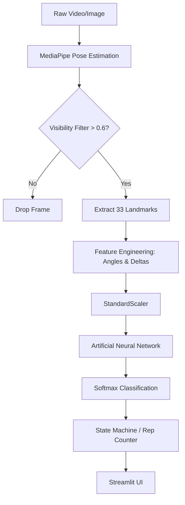

Here is the complete Markdown code. You can copy everything inside the block below and paste it directly into your `README.md` file.

```markdown
<div align="center">

<!-- 1. Project Banner Placeholder -->


<!-- 2. Project Title -->
# AI-Based Exercise & Yoga Pose Detection System

<!-- 3. One-line Description -->
**A real-time, edge-capable Artificial Intelligence system for exercise repetition counting, stage detection, and yoga pose classification.**

<!-- 4. Badges -->
[](https://www.python.org/downloads/)
[](https://tensorflow.org)
[](https://opencv.org/)
[](https://streamlit.io/)
[](https://onnx.ai/)
[](https://opensource.org/licenses/MIT)
[](https://github.com/yourusername/pose-detection-ai/stargazers)
[](https://github.com/yourusername/pose-detection-ai/network/members)
[](https://github.com/yourusername/pose-detection-ai/issues)
[](https://github.com/yourusername/pose-detection-ai/commits/main)

</div>

---

## 📋 5. Table of Contents

<details>
<summary>Click to expand</summary>

- [Project Overview](#-6-project-overview)
- [Problem Statement](#-7-problem-statement)
- [Motivation](#-8-motivation)
- [Features](#-9-features)
- [System Architecture](#-10-system-architecture)
- [Project Workflow](#-11-project-workflow)
- [Dataset](#-12-dataset)
- [Technology Stack](#-13-technology-stack)
- [Project Structure](#-14-project-structure)
- [Installation Guide](#-15-installation-guide)
- [Requirements](#-16-requirements)
- [How to Run](#-17-how-to-run)
- [Model Pipeline](#-18-model-pipeline)
- [Feature Engineering Pipeline](#-19-feature-engineering-pipeline)
- [ANN Architecture](#-20-ann-architecture)
- [Training Pipeline](#-21-training-pipeline)
- [Evaluation Metrics](#-22-evaluation-metrics)
- [Results](#-23-results)
- [Inference](#-24-inference)
- [Deployment](#-25-deployment)
- [Future Improvements](#-26-future-improvements)
- [Contributing](#-27-contributing)
- [License](#-28-license)
- [Acknowledgements](#-29-acknowledgements)
- [Contact Information](#-30-contact-information)
- [Citation](#-31-citation)

</details>

---

## 🔬 6. Project Overview

This repository contains the source code for an AI-based fitness and yoga pose analysis system. By utilizing Google's MediaPipe Tasks API for biological landmark extraction and a lightweight Artificial Neural Network (ANN) for classification, the system identifies exercises, counts repetitions, tracks movement stages, and evaluates static yoga poses. 

The architecture is specifically designed for low-latency edge deployment, decoupling heavy computer vision processing from the machine learning classification layer.

---

## ⚠️ 7. Problem Statement

Traditional computer vision approaches for fitness tracking rely heavily on deep Convolutional Neural Networks (CNNs) processing raw RGB video frames. This methodology introduces significant engineering bottlenecks:
1. **High Latency:** Processing raw pixels at 30 FPS requires heavy GPU compute.
2. **Background Overfitting:** CNNs frequently memorize training environments (e.g., gym backgrounds, specific lighting) rather than human biomechanics.
3. **Edge Incompatibility:** Large model sizes (100MB+) preclude deployment on standard mobile devices or edge CPUs.

---

## 💡 8. Motivation

This project abandons the image-to-CNN paradigm. Instead, it utilizes deterministic skeletal extraction (MediaPipe) to reduce a high-dimensional image into a 33-point geometric coordinate map. By engineering scale- and translation-invariant mathematical features (joint angles, normalized distances) from these coordinates, we can train a shallow ANN that requires less than 2MB of memory and executes inference in sub-15ms on standard CPUs.

---

## ✨ 9. Features

- **Multi-Modal Input Support:** Image, Video, and Real-Time Webcam streams.
- **Exercise Mode:**
  - Continuous exercise classification.
  - State-machine driven repetition counting.
  - Movement stage detection (Concentric vs. Eccentric).
- **Yoga Mode:**
  - Static pose classification.
  - Pose hold timers and stability tracking.
- **Edge-Optimized:** Sub-15ms CPU inference via ONNX Runtime.

---

## 🏛️ 10. System Architecture

*Architecture diagram placeholder. To be added upon finalization of the deployment infrastructure.*

<!--  -->

---

## 🔄 11. Project Workflow



---

## 📊 12. Dataset

*Dataset statistics and processing methodologies are currently under active development. This section will be populated once the data engineering pipelines are finalized.*

### Exercise Dataset

* **Source:** *To be confirmed after validation.*
* **Classes:** *Under Development.*
* **Samples:** *Under Development.*

### Yoga Dataset

* **Source:** *To be confirmed after validation.*
* **Classes:** *Under Development.*
* **Samples:** *Under Development.*

---

## 💻 13. Technology Stack

| Component | Technology | Purpose |
| --- | --- | --- |
| **Core Language** | Python 3.10+ | Primary language for data pipelines and backend logic. |
| **Computer Vision** | OpenCV | High-speed frame extraction and geometric rendering. |
| **Pose Estimation** | MediaPipe Tasks API | CPU-optimized extraction of 33 3D skeletal landmarks. |
| **Data Engineering** | NumPy, Pandas | Vectorized kinematic math and tabular dataset construction. |
| **Machine Learning** | Scikit-Learn | Z-score standardization and classical ML baselines. |
| **Deep Learning** | TensorFlow / Keras | Construction and training of the Multi-Layer Perceptron (ANN). |
| **Deployment Format** | ONNX | Open Neural Network Exchange for hardware-agnostic execution. |
| **Inference Engine** | ONNX Runtime | C++ backed execution graph for sub-millisecond predictions. |
| **Frontend UI** | Streamlit | WebRTC-enabled reactive web application. |

---

## 📂 14. Project Structure

```text
pose-detection-ai/
├── data/
│   ├── raw/                 # Source video and image files (ignored)
│   ├── processed/           # Extracted frames
│   └── features/            # Serialized CSV datasets
├── notebooks/               # Research and EDA environments
├── src/                     # Production source code
│   ├── cv_engine/           # MediaPipe wrappers
│   ├── feature_math/        # Kinematic calculators
│   ├── models/              # ONNX inference handlers
│   └── state_machine/       # Rep counters & stage trackers
├── app/                     # Streamlit frontend
├── artifacts/               # Serialized models and scalers
├── tests/                   # Pytest suites
├── requirements.txt         # Dependency lock
└── README.md                # Project documentation

```

---

## ⚙️ 15. Installation Guide

```bash
# Clone the repository
git clone [https://github.com/yourusername/pose-detection-ai.git](https://github.com/yourusername/pose-detection-ai.git)
cd pose-detection-ai

# Create a virtual environment
python -m venv venv
source venv\Scripts\activate

# Install dependencies
pip install -r requirements.txt

```

```bash
# Clone the repository
git clone [https://github.com/yourusername/pose-detection-ai.git](https://github.com/yourusername/pose-detection-ai.git)
cd pose-detection-ai

# Create a virtual environment
python3 -m venv venv
source venv/bin/activate

# Install dependencies
pip install -r requirements.txt

```

```bash
# Clone the repository
git clone [https://github.com/yourusername/pose-detection-ai.git](https://github.com/yourusername/pose-detection-ai.git)
cd pose-detection-ai

# Create a virtual environment
python3 -m venv venv
source venv/bin/activate

# Install dependencies
pip install -r requirements.txt

```

---

## 📦 16. Requirements

Ensure you are running Python `3.10` or higher. Core dependencies include:

* `tensorflow>=2.15.0`
* `mediapipe>=0.10.0`
* `opencv-python>=4.8.0`
* `scikit-learn>=1.3.0`
* `streamlit>=1.30.0`
* `streamlit-webrtc>=0.47.0`
* `onnxruntime>=1.16.0`

*Refer to `requirements.txt` for the full dependency tree.*

---

## 🚀 17. How to Run

*Command parameters will be finalized prior to release.*

```bash
# Start the Streamlit Web Application
streamlit run app/main.py

```

---

## 🧠 18. Model Pipeline

*Implementation details are currently under development. To be added after modeling phase.*

---

## 📐 19. Feature Engineering Pipeline

*Mathematical formulas and invariant calculations (angles, normalized distances) will be documented here post-experimentation.*

---

## 🕸️ 20. ANN Architecture

*Network topology (layers, nodes, activations, regularization) to be added after hyperparameter tuning.*

---

## 🚂 21. Training Pipeline

*Training configurations (batch size, epochs, optimizers, loss functions) to be added after training convergence.*

---

## 📈 22. Evaluation Metrics

*Validation and test metrics (Accuracy, Macro F1, Precision, Recall) will be published here upon completion of Model Selection.*

---

## 🏆 23. Results

*Visualizations of confusion matrices, learning curves, and comparative latency benchmarks to be added.*

---

## 👁️ 24. Inference

The system handles three execution modes:

* **Image Prediction:** Single-frame forward pass. Extracts landmarks, normalizes, scales, and returns the static classification.
* **Video Prediction:** Sequential frame processing. Implements a temporal debounce filter to stabilize predictions across contiguous frames.
* **Live Webcam:** Utilizes WebRTC for asynchronous, non-blocking UDP stream processing directly within the browser, minimizing HTTP latency overhead.

---

## 🌐 25. Deployment

*Deployment infrastructure (Docker orchestration, cloud hosting specifics) is under development.*

---

## 🔮 26. Future Improvements

* [ ] Implementation of LSTM/GRU layers for advanced temporal sequence tracking.
* [ ] Exporting models to TensorRT for edge GPU acceleration.
* [ ] Mobile deployment via TensorFlow Lite.
* [ ] 3D rendering of posture correction vectors.

---

## 🤝 27. Contributing

We welcome contributions from the community. Please follow these steps:

1. Fork the repository.
2. Create a feature branch (`git checkout -b feature/NewFeature`).
3. Commit your changes (`git commit -m 'Add NewFeature'`).
4. Push to the branch (`git push origin feature/NewFeature`).
5. Open a Pull Request.

Ensure all new code is covered by `pytest` and adheres to PEP8 standards.

---

## 📄 28. License

This project is licensed under the [MIT License](https://www.google.com/search?q=LICENSE).

---

## 🙏 29. Acknowledgements

* [Google MediaPipe](https://developers.google.com/mediapipe) for the BlazePose topology.
* Researchers and maintainers of the foundational datasets utilized in this pipeline.

---

## 📬 30. Contact Information

**Maintainer:** [Your Name / Team Name]

**Email:** your.email@example.com

**LinkedIn:** [Your Profile](https://linkedin.com/in/yourprofile)

**Project Link:** [https://github.com/yourusername/pose-detection-ai](https://www.google.com/url?sa=E&source=gmail&q=https://github.com/yourusername/pose-detection-ai)

---

## 📜 31. Citation

If you use this code or architecture in your research, please cite:

```bibtex
@misc{pose-detection-ai,
  author = {Your Name},
  title = {AI-Based Exercise & Yoga Pose Detection System},
  year = {2026},
  publisher = {GitHub},
  journal = {GitHub repository},
  howpublished = {\url{[https://github.com/yourusername/pose-detection-ai](https://github.com/yourusername/pose-detection-ai)}}
}

```

---

## ⭐ 32. Show your support

If you found this project helpful or learned something new, please consider giving it a **Star** ⭐️! It helps others find the repository.

```

```